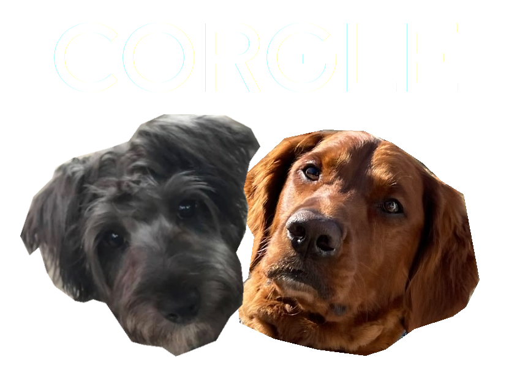

Application is currently live at [corgle.tech!](http://www.corgle.tech)

## Inspiration
Dogs are almost universally loved, and the same goes for Wordle. We wanted to combine these two to create a game to improve mental wellness. Corgle is a low-stress way for users to enjoy some cute dogs while also gaining fulfillment from completing a short game. 

## What it does
Corgle is a Wordle inspired accessible game designed to improve mental wellness through cute dogs and a fun little game. How Corgle works is everyday a new dog is posted. This includes pictures of the dog (as well as captions describing the dog for accesbile purposes) and a phrase about the dog. The user is tasked with determining the dog's name in the same way that Wordle is played, guessing and confirming letters along the way. The goal is to find the dog's name before you run out of guesses! Our mission witt this game was to improve the mental wellness of the player by giving them a cute wholesome challenge they can look forward to each day.

## How we built it
Corgle uses many frameworks: 
Python and Tweepy, a twitter api, in order to retrieve and format dog data into a json file and import into MongoDB database 
React, typescript, and scss to create functional components to control game state 
NestJS to link React frontend and MongoDB database 
Google Cloud to host everything

## Challenges we ran into
Getting familiar with MongoDB, NestJS, Tweepy, all new frameworks to everyone 
Desiging the Dog object class and figuring out all the different API calls that needed to be made 
Populating the database in Mongo from JSON 
Querying the database with specific IDs 
Getting familiar with Google Cloud

## Accomplishments that we're proud of
Aggregating complete data for over 200 dogs 
Including accessibility support data for each and every dog 
Setting up a working database with get and post request functionality 
Making an X button on a modal 
Implementing the Worlde-inspired functionality from scratch

## What we learned
Learned how to interact with the Tweepy API   
Became much more familiar and comfortable with JSON, MongoDB, Tweepy   
End-to-end development cycle concepts 
Interfacing backend and frontend efficiently 
Good coding practices, design principles

## What's next for Corgle
Some stretch goals include: 
Rating system for each dog (some aspects already implemented) 
Leader boards and Minting of high schoe holder 
Including videos as well as pictures (after obtaining Tweepy clearance)
